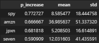

# Project 2 - Financial analysis: USA vs JAP comparison

# Index
### 1. Hypothesis
### 2. *Getting the data
1. *Historic data values for specific symbold
2. *Historic USA PIB
3. *Historic JAP PIB
### 3. *Load the data into SQL
### 4. *Extracting data from SQL
### 5. Analyzing the data
1. Correllation Analysis
2. Historic evolution
3. Distribution analysis
### 6. Running expermients
### 7. Conlusion 

* For this sections, please go to main file. We use there mainly functions that are inside the modularization.py srcipt

# 1. Hypothesis

USA market is more attractive for investors than JPN one. 

For this hypothesis we are going to see:

1. PIB historical results for each country (scripting a web page)
2. Historical Index results related to most valuables companies: S&P 500 for US, JPXN for JPN (using yfinance API)
3. Historical stock value results for a big retail company: AMZN for US, SEVEN for JPN

 

# 5. Analyzing the data

### 1. Correllation Analysis 

Figure1:

Making the correllation of the yearly results of each indicators, numbers received are quite high and suspicious. Thus, will move forward with making the correllation analysis with the YoY growth rates

 
 

Figure 2:

AMZN and S&P 500 YoY growth have a stronger correllation than seven and JPXN YoY growth (0.4 vs. 0.35). Let's plot it! We will use a scatterplot

 

Figure 3:

 
 
If we go back to the Figure 2, we could also see the high correllation between S&P 500 and AMZN. Let's as well plot it using a scatterplot

 

Figure 4:

 
 

And once again, if we go back to the Figure 2, would be interesting to see the correlation between the US and JAP PIB YoY growth rate. Let's as well plot it using a scatterplot

Figure 5:

GDP growth rate US vs. JAP: US PIB is more stable and almost always possitive (2-11) while JAP is more volatil (-15;10). There is no correllation between the PIB growth of both countries.

 
 

### 2. Historic evolution

Figure 6:

Figure 7:

SEVEN has been reaching multiple times (6) new historic max values during the last 3 years. AMZN is recovering from post-pandemic values. Right now it's at pre-pandemic value.

 
 

### 3. Distribution Analisis

Figure 8:

Figure 9:

1. S&P 500 is the stock with a considerable low std (16) and quite high YoY growth mean (8%) making it the most attractive active to invest.

2. amzn is the stock with the highest YoY growth mean (33%), but as well with a considerable high std (51) making it a most risky investment.

 

# 6. Running expermients

Figure 10:

# 7. Conclusion

-> US market is more stable and less risky than JAP one
-> S&P 500 is the less risky and with consistent benefits YoY
-> SEVEN is a company that has been increased for several years, so I wouldn't invest on it
-> AMZN is a company with a current low value; there is a growth opportunity
